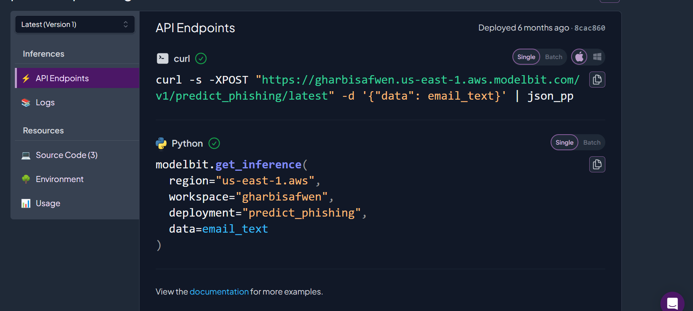

# Projet de Détection d'Emails de Phishing

## Aperçu
Ce projet implémente une solution basée sur l'apprentissage automatique pour détecter les emails de phishing. Il utilise des techniques de traitement du langage naturel et d'apprentissage automatique pour analyser le contenu des emails et identifier les tentatives potentielles de phishing.

## 🔗 Modelbit API Endpoint

Below is a live example of the endpoint you can call.

<!-- Screenshot -->


## Auteur
- **Safwen Gharbi**
- GitHub: [safwen5ds](https://github.com/safwen5ds)

## Structure du Projet
```
.
├── Phishing_detection.ipynb    # Notebook Jupyter principal contenant l'analyse et le modèle
├── phishing_email.csv         # Jeu de données d'emails de phishing
├── test.csv                   # Jeu de données de test
├── tfidf_vectorizer1.pkl      # Modèle de vectorisation TF-IDF 1
├── tfidf_vectorizer2.pkl      # Modèle de vectorisation TF-IDF 2
└── tfidf_vectorizer3.pkl      # Modèle de vectorisation TF-IDF 3
```

## Fonctionnalités
- Analyse du contenu des emails utilisant la vectorisation TF-IDF
- Détection de phishing basée sur l'apprentissage automatique
- Modèles de vectorisation multiples pour une précision accrue
- Jeu de données complet pour l'entraînement et les tests

## Prérequis
Pour exécuter ce projet, vous aurez besoin de :
- Python 3.x
- Jupyter Notebook
- Packages Python requis (installation via pip) :
  ```bash
  pip install pandas numpy scikit-learn jupyter
  ```

## Utilisation
1. Cloner le dépôt :
   ```bash
   git clone https://github.com/safwen5ds/Projet_Cyber_CI2_FSB.git
   cd Projet_Cyber_CI2_FSB
   ```

2. Ouvrir le notebook Jupyter :
   ```bash
   jupyter notebook Phishing_detection.ipynb
   ```

3. Exécuter les cellules du notebook pour :
   - Charger et prétraiter les données
   - Entraîner le modèle
   - Évaluer les résultats
   - Faire des prédictions sur de nouveaux emails

## Jeu de Données
Le projet utilise un jeu de données complet d'emails de phishing (`phishing_email.csv`) pour l'entraînement et un jeu de données de test séparé (`test.csv`) pour l'évaluation.

## Modèle
Le projet implémente la vectorisation TF-IDF pour le traitement du texte et des algorithmes d'apprentissage automatique pour la classification. Trois modèles de vectorisation différents sont inclus pour la comparaison et les méthodes d'ensemble.

## Licence
Ce projet est open source et disponible sous la licence MIT.
